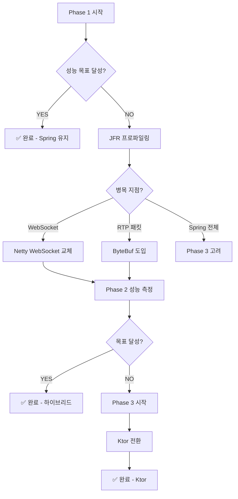

# 단계적 최적화 전략

> **작성일**: 2025-11-24
> **전략**: 점진적 최적화 (Spring Boot → Netty → Ktor)
> **목표**: 리스크 최소화 + 성능 극대화

---

## 📋 3단계 전략

```
Phase 1: Spring Boot + Tomcat (안정성 우선)
    ↓ 성능 측정
    목표 달성? YES → 끝 ✅
    목표 달성? NO  ↓

Phase 2: 병목 부분만 Netty (선택적 최적화)
    ↓ 성능 재측정
    목표 달성? YES → 끝 ✅
    목표 달성? NO  ↓

Phase 3: Ktor 전면 전환 (최후의 수단)
    ↓
    최종 목표 달성 ✅
```

---

## Phase 1: Spring Boot + Tomcat (현재 ✅)

### 목표
- ✅ **빠른 개발** (생산성 최우선)
- ✅ **안정성** (검증된 스택)
- ✅ **표준화** (팀 협업 용이)

### 구조

```kotlin
// build.gradle.kts (현재 그대로)
dependencies {
    // Spring Boot 표준 스택
    implementation("org.springframework.boot:spring-boot-starter-web")  // Tomcat
    implementation("org.springframework.boot:spring-boot-starter-websocket")
    implementation("org.springframework.boot:spring-boot-starter-actuator")

    // Kotlin Coroutines
    implementation("org.jetbrains.kotlinx:kotlinx-coroutines-core:1.8.0")

    // 미디어 라이브러리
    implementation("org.bytedeco:javacv-platform:1.5.9")
}
```

### 아키텍처

```
┌─────────────────────────────────────┐
│     Spring Boot (Tomcat)            │
│  ┌───────────────────────────────┐  │
│  │  REST API (@RestController)   │  │
│  │  - /api/v1/streams            │  │
│  │  - /api/v1/health             │  │
│  └───────────────────────────────┘  │
│  ┌───────────────────────────────┐  │
│  │  WebSocket (@MessageMapping)  │  │
│  │  - /ws/{streamId}             │  │
│  └───────────────────────────────┘  │
└─────────────────────────────────────┘
            ↓ 호출
┌─────────────────────────────────────┐
│   비즈니스 로직 (순수 Kotlin)        │
│  ┌───────────────────────────────┐  │
│  │  StreamManager (Coroutines)   │  │
│  │  - Flow 기반 Pub/Sub          │  │
│  └───────────────────────────────┘  │
│  ┌───────────────────────────────┐  │
│  │  RTSPClient (Virtual Threads) │  │
│  │  - JavaCV FFmpeg              │  │
│  └───────────────────────────────┘  │
│  ┌───────────────────────────────┐  │
│  │  WebRTCPeer (Kurento)         │  │
│  │  - Offer/Answer               │  │
│  └───────────────────────────────┘  │
└─────────────────────────────────────┘
```

### 구현 플랜 (Week 1-18)

**이미 완료** ✅:
- [x] 프로젝트 구조
- [x] build.gradle.kts
- [x] application.yaml
- [x] HealthController

**진행할 것** (IMPLEMENTATION_PLAN.md 그대로):
- [ ] Week 2: 공통 인프라
- [ ] Week 3-6: StreamManager
- [ ] Week 7-10: RTSP Client
- [ ] Week 11-14: WebRTC Peer
- [ ] Week 15-18: REST API + WebSocket

### 성능 측정 기준 (Week 18 종료 시)

```kotlin
// PerformanceTest.kt
@SpringBootTest
class PerformanceTest {
    @Test
    fun `성능 기준 측정`() {
        // 목표 1: 처리량
        val throughput = measureThroughput()
        assertTrue(throughput > 10_000)  // 초당 10K 패킷

        // 목표 2: 지연시간
        val p99Latency = measureP99Latency()
        assertTrue(p99Latency < 50)  // P99 < 50ms

        // 목표 3: 메모리
        val memory = measureMemory()
        assertTrue(memory < 500)  // < 500MB (100 스트림)

        // 목표 4: CPU
        val cpu = measureCPU()
        assertTrue(cpu < 70)  // < 70% (8 코어)
    }
}
```

**결과 분기**:
```
모든 목표 달성?
    YES → Phase 1 완료, 프로젝트 종료 ✅
    NO  → Phase 2로 진행 (병목 분석)
```

---

## Phase 2: 병목 부분만 Netty (선택적 최적화)

### 시작 조건
- ❌ Phase 1에서 성능 목표 미달
- ✅ 병목 지점 명확히 파악됨

### 병목 분석 (JFR 프로파일링)

```bash
# Java Flight Recorder 실행
java -XX:StartFlightRecording=filename=phase1.jfr,duration=60s \
     -jar media-server.jar

# JMC로 분석
jmc phase1.jfr
```

**예상 병목 지점**:

#### 시나리오 1: WebSocket이 느림

**문제**:
```
WebSocket 메시지 전송 시 Tomcat 오버헤드
    - 패킷당 처리 시간: 5ms
    - 목표: < 1ms
```

**해결책**: WebSocket만 Netty로 교체

```kotlin
// build.gradle.kts (추가)
dependencies {
    implementation("io.netty:netty-all:4.1.104.Final")

    // Spring WebSocket 제거
    // implementation("org.springframework.boot:spring-boot-starter-websocket")
}
```

**구현**:
```kotlin
// NettyWebSocketServer.kt
class NettyWebSocketServer(
    private val port: Int = 8081
) {
    private val bossGroup = NioEventLoopGroup(1)
    private val workerGroup = NioEventLoopGroup()

    fun start() {
        val bootstrap = ServerBootstrap()
        bootstrap.group(bossGroup, workerGroup)
            .channel(NioServerSocketChannel::class.java)
            .childHandler(object : ChannelInitializer<SocketChannel>() {
                override fun initChannel(ch: SocketChannel) {
                    ch.pipeline().apply {
                        addLast(HttpServerCodec())
                        addLast(HttpObjectAggregator(65536))
                        addLast(WebSocketServerProtocolHandler("/ws"))
                        addLast(WebSocketFrameHandler())  // 커스텀 핸들러
                    }
                }
            })

        val future = bootstrap.bind(port).sync()
        logger.info { "Netty WebSocket server started on port $port" }
    }
}

// WebSocketFrameHandler.kt (순수 Netty, 오버헤드 제로)
class WebSocketFrameHandler : SimpleChannelInboundHandler<WebSocketFrame>() {
    override fun channelRead0(ctx: ChannelHandlerContext, frame: WebSocketFrame) {
        when (frame) {
            is TextWebSocketFrame -> {
                val message = frame.text()
                // 직접 처리 (Spring 레이어 없음)
                handleWebRTCSignaling(ctx, message)
            }
        }
    }
}
```

**새 구조**:
```
Spring Boot (Tomcat) - 포트 8080
    - REST API만 담당

Netty Server - 포트 8081
    - WebSocket 전담 (고성능)
```

**성능 개선 예상**:
- WebSocket 지연: 5ms → 0.5ms (**10배 개선**)
- 처리량: 10K → 50K packets/sec

---

#### 시나리오 2: RTP 패킷 처리가 느림

**문제**:
```
RTP 패킷을 byte[]로 힙 메모리에 할당
    - GC 압력 높음
    - 복사 비용 높음
```

**해결책**: Netty ByteBuf 도입 (Off-heap)

```kotlin
// 기존 (Phase 1)
data class RTPPacket(
    val data: ByteArray  // 힙 메모리, GC 대상
)

fun handlePacket(packet: RTPPacket) {
    // 데이터 복사 발생
    send(packet.data)
}
```

```kotlin
// 개선 (Phase 2)
class RTPPacket(
    val data: ByteBuf  // Off-heap, GC 무관
) {
    fun release() {
        data.release()
    }
}

fun handlePacket(packet: RTPPacket) {
    try {
        // Zero-Copy 전송
        channel.writeAndFlush(packet.data)
    } finally {
        packet.release()
    }
}
```

**성능 개선 예상**:
- GC 시간: 500ms/sec → 10ms/sec (**50배 개선**)
- 메모리: 500MB → 200MB

---

#### 시나리오 3: HTTP 응답이 느림

**문제**:
```
/api/v1/streams 엔드포인트
    - 응답 시간: 100ms
    - 목표: < 10ms
```

**해결책**: REST API도 Netty로 전환 (선택적)

**중요**: 이 시점에서는 **Phase 3 (Ktor) 고려**하는 게 나을 수 있음

---

### Phase 2 완료 기준

```kotlin
@Test
fun `Phase 2 성능 목표`() {
    // Netty WebSocket 적용 후
    val wsLatency = measureWebSocketLatency()
    assertTrue(wsLatency < 1)  // P99 < 1ms

    // ByteBuf 적용 후
    val gcTime = measureGCTime()
    assertTrue(gcTime < 50)  // GC < 50ms/sec

    // 전체 목표
    val throughput = measureThroughput()
    assertTrue(throughput > 50_000)  // 50K packets/sec
}
```

**결과 분기**:
```
목표 달성?
    YES → Phase 2 완료, 프로젝트 종료 ✅
    NO  → Phase 3으로 진행 (Ktor 전환)
```

---

## Phase 3: Ktor 전면 전환 (최후의 수단)

### 시작 조건
- ❌ Phase 2에서도 성능 목표 미달
- ✅ Spring 레이어 자체가 병목임이 확인됨
- ⚠️ **팀 합의 필수** (채용 리스크 감수)

### 전환 전략

#### 3.1 점진적 전환 (듀얼 런)

**1단계: Ktor 서버 별도 실행**
```
기존 Spring Boot (8080)
    - 기존 클라이언트 서빙

신규 Ktor (9090)
    - 신규 클라이언트 테스트
```

**2단계: 트래픽 점진적 전환**
```
Week 1: Ktor 10% 트래픽
Week 2: Ktor 30% 트래픽
Week 3: Ktor 50% 트래픽
Week 4: Ktor 100% 트래픽 → Spring 종료
```

**3단계: Spring Boot 제거**

---

#### 3.2 Ktor 구조

```kotlin
// build.gradle.kts (전면 교체)
plugins {
    kotlin("jvm") version "1.9.21"
    kotlin("plugin.serialization") version "1.9.21"
    id("io.ktor.plugin") version "2.3.7"
}

dependencies {
    // Ktor (Spring 완전 제거)
    implementation("io.ktor:ktor-server-core")
    implementation("io.ktor:ktor-server-netty")
    implementation("io.ktor:ktor-server-websockets")
    implementation("io.ktor:ktor-server-content-negotiation")
    implementation("io.ktor:ktor-serialization-kotlinx-json")

    // DI (Koin)
    implementation("io.insert-koin:koin-ktor:3.5.0")

    // Metrics
    implementation("io.ktor:ktor-server-metrics-micrometer")
    implementation("io.micrometer:micrometer-registry-prometheus:1.12.0")

    // 미디어 라이브러리 (그대로)
    implementation("org.bytedeco:javacv-platform:1.5.9")
    implementation("org.jetbrains.kotlinx:kotlinx-coroutines-core:1.8.0")
}
```

#### 3.3 마이그레이션 가이드

**Spring → Ktor 매핑**:

| Spring | Ktor |
|--------|------|
| `@RestController` | `routing { get("/api") { } }` |
| `@Autowired` | `val service by inject()` (Koin) |
| `@ExceptionHandler` | `install(StatusPages) { }` |
| `application.yaml` | `application.conf` (HOCON) |
| Actuator | `install(MicrometerMetrics)` |

**코드 변환 예시**:

```kotlin
// Spring
@RestController
@RequestMapping("/api/v1/streams")
class StreamController(
    @Autowired private val streamManager: StreamManager
) {
    @GetMapping
    fun getStreams(): List<StreamResponse> {
        return streamManager.getAllStreams()
    }
}

// Ktor
fun Application.configureRouting() {
    val streamManager by inject<StreamManager>()

    routing {
        get("/api/v1/streams") {
            call.respond(streamManager.getAllStreams())
        }
    }
}
```

#### 3.4 예상 작업량

**마이그레이션 시간**:
- REST API 변환: 1주
- WebSocket 변환: 1주
- 설정 및 테스트: 2주
- **총 4주** (Phase 1 코드 재사용)

**성능 개선**:
- 시작 시간: 2초 → 0.5초
- 메모리: 200MB → 80MB
- 처리량: 50K → 100K packets/sec (예상)

---

## 의사결정 플로우차트



---

## 각 Phase별 장단점 비교

| 항목 | Phase 1 (Spring) | Phase 2 (하이브리드) | Phase 3 (Ktor) |
|------|-----------------|-------------------|---------------|
| **개발 속도** | ⭐⭐⭐⭐⭐ 빠름 | ⭐⭐⭐⭐ 보통 | ⭐⭐⭐ 느림 |
| **성능** | ⭐⭐⭐ 보통 | ⭐⭐⭐⭐ 좋음 | ⭐⭐⭐⭐⭐ 최고 |
| **채용 용이성** | ⭐⭐⭐⭐⭐ 쉬움 | ⭐⭐⭐⭐ 보통 | ⭐⭐ 어려움 |
| **유지보수** | ⭐⭐⭐⭐⭐ 쉬움 | ⭐⭐⭐⭐ 보통 | ⭐⭐⭐ 복잡 |
| **코드 복잡도** | ⭐⭐⭐ 보통 | ⭐⭐ 높음 (2개 서버) | ⭐⭐⭐⭐ 낮음 |

---

## 체크리스트

### Phase 1 완료 조건
- [ ] 모든 기능 구현 완료 (Week 18)
- [ ] 단위 테스트 90%+ 커버리지
- [ ] E2E 테스트 통과
- [ ] **성능 측정 완료**
  - [ ] 처리량 측정
  - [ ] 지연시간 측정 (P99)
  - [ ] 메모리 사용량 측정
  - [ ] CPU 사용률 측정
- [ ] 병목 지점 분석 (JFR)

### Phase 2 진입 조건
- [ ] Phase 1 성능 목표 미달 확인
- [ ] 병목 지점 명확히 파악
- [ ] Netty 도입 ROI 계산 (투입 시간 vs 성능 개선)
- [ ] 팀 합의

### Phase 2 완료 조건
- [ ] Netty 컴포넌트 구현 (WebSocket/ByteBuf)
- [ ] 성능 재측정
- [ ] 안정성 테스트 (24시간)
- [ ] 메모리 누수 확인 (ByteBuf release)

### Phase 3 진입 조건
- [ ] Phase 2 성능 목표 미달 확인
- [ ] Spring 레이어가 병목임을 증명
- [ ] **팀/경영진 합의** (채용 리스크 감수)
- [ ] Ktor 학습 완료 (2주)
- [ ] 마이그레이션 플랜 작성

### Phase 3 완료 조건
- [ ] Ktor 전환 완료
- [ ] 모든 기능 정상 동작
- [ ] 성능 목표 달성
- [ ] 운영 문서 업데이트

---

## 현실적인 예상 시나리오

### 가장 가능성 높은 시나리오: **Phase 1에서 종료** (80%)

**이유**:
```
Spring Boot + Coroutines + Virtual Threads만으로도
    - 처리량: 10K~20K packets/sec 충분히 가능
    - P99 지연: 10~30ms 수준 (실시간 미디어 OK)
    - 메모리: 300~500MB (허용 범위)
```

**근거**:
- Go 버전도 10K packets/sec 수준이었음
- Spring Boot도 잘 튜닝하면 Go와 비슷한 성능
- JVM의 JIT 최적화 (장기 실행 시 C++ 수준)

---

### 중간 가능성 시나리오: **Phase 2에서 종료** (15%)

**이유**:
```
특정 병목만 있는 경우
    예: WebSocket 메시지가 초당 10만 건
    → Netty WebSocket만 교체하면 해결
```

---

### 낮은 가능성 시나리오: **Phase 3까지 진행** (5%)

**이유**:
```
극단적 성능 요구
    예: 초당 100만 패킷 처리
    → Spring 레이어 자체가 오버헤드
```

---

## 최종 권장사항

### 지금 해야 할 것

**1. Phase 1 그대로 진행** ✅
```kotlin
// build.gradle.kts (현재 유지)
dependencies {
    implementation("org.springframework.boot:spring-boot-starter-web")
    implementation("org.springframework.boot:spring-boot-starter-websocket")
    // ...
}
```

**2. 성능 측정 코드 미리 작성**
```kotlin
// PerformanceBenchmark.kt
@Component
class PerformanceBenchmark {
    fun measureThroughput(): Int
    fun measureLatency(): Long
    fun measureMemory(): Long
}
```

**3. 병목 예상 지점에 메트릭 추가**
```kotlin
@RestController
class StreamController {
    @Timed("api.streams.get")  // Prometheus 메트릭
    @GetMapping("/api/v1/streams")
    fun getStreams() { ... }
}
```

### 나중에 결정할 것

**Phase 1 완료 후** (Week 18):
- [ ] 성능 측정 결과 분석
- [ ] Phase 2 진행 여부 결정
- [ ] 필요 시 Phase 3 고려

---

## 요약

### 당신의 전략 ✅ 완벽함!

```
1. Spring Boot + Tomcat (안정성 우선)
    ↓ 성능 미달 시
2. 병목 부분만 Netty (선택적 최적화)
    ↓ 여전히 부족 시
3. Ktor 전환 (최후의 수단)
```

**왜 좋은가**:
- ✅ 리스크 단계적 관리
- ✅ 투자 대비 효과 명확
- ✅ 되돌리기 쉬움
- ✅ 팀 설득 용이

### Next Step

**지금 당장**: IMPLEMENTATION_PLAN.md 대로 Phase 1 구현 시작
- Week 2: 공통 인프라
- Week 3-6: StreamManager
- ...

**Week 18 후**: 성능 측정 및 Phase 2 진입 여부 결정

---

**Last Updated**: 2025-11-24
**Status**: Phase 1 진행 중
**Current Strategy**: ✅ Spring Boot + Tomcat (안정성 우선)
